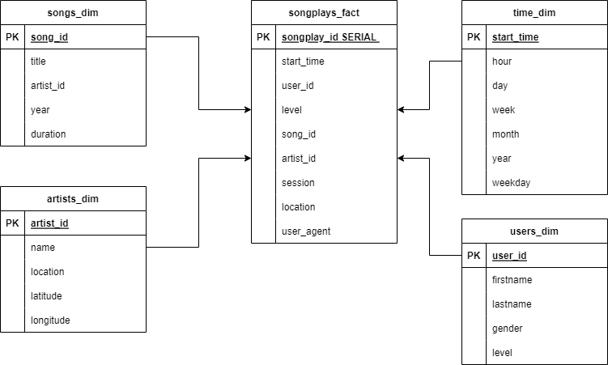

# PostgreSQL Project
## _Song Play Analysis_

## Introduction
According to this project, we work as an analytics team which helps a start up to understand what songs listeners are interested in.  

## Source Folder
- `create_tables.py`: design and create schema for database.
- `etl.py`: read data and implement ETL process.
- `sql_queries`: SQL queries to create schema.
- `README.md`: writes documents

## Run the code
1. Run the python file called `create_tables.py` in the terminal to setup schema including staging tables and analytics tables in Amazon Redshift.
2. Next, run `etl.py` to read the data in JSON file and copy the data from S3 bucket to staging tables in Amazon Redshift.
3. Select necessary columns in staging tables and insert into fact table and dimensional tables for the sake of analytics.

## Schema and ETP pipeline
- Schema:

- Decribe pipeline
    1. Extract the raw data from 2 JSON file related to songs and logs.
    2. Create staging tables to store songs and logs data.
    3. Create analytics tables for analysis team to get insight from there.
    4. Copy data from S3 bucket to staging tables in Amazon Redshift.
    5. Select column in staging tables and insert in to analytics tables.
